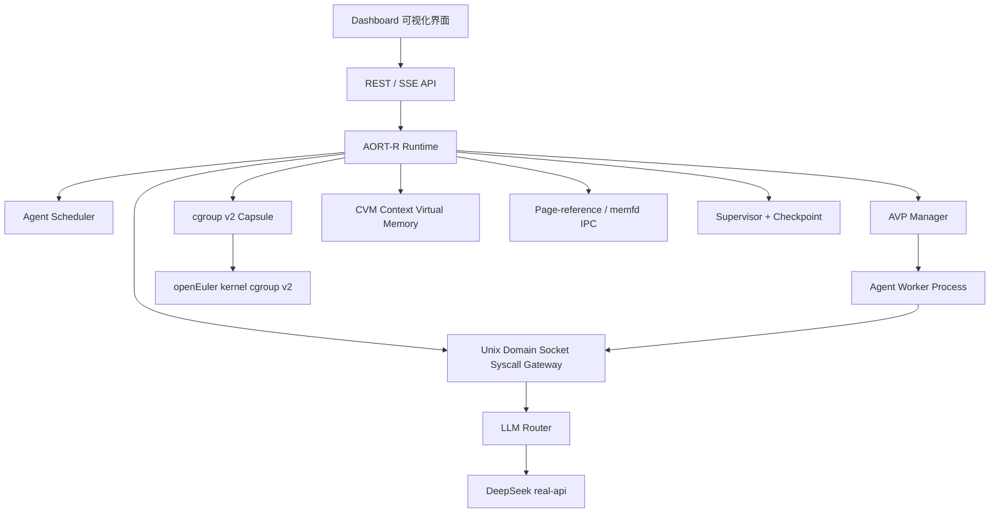

# AORT-R 面向多智能体的操作系统级执行时技术报告

> 整改说明：本文保留历史交付叙述；当前问题驱动技术报告以 `docs/design/README.md` 的 10 章为准。AVP、Gateway、CVM、IPC、cgroup/OverlayFS 和 eBPF 的边界以 `docs/defense/CLAIMS_BOUNDARY.md` 与最新 evidence_mode 为准。

## 1. 作品链接

作品名称：AORT-R Agent Runtime

代码仓库：https://github.com/yxyyyyyyyy/os_complete


云端真实环境：openEuler 24.03 LTS x86_64，cgroup v2，root 权限运行 AORT-R Runtime。前端 Dashboard 可在本地打开，通过 API/SSH 代理访问云端 openEuler 上的真实 Runtime，因此页面展示的是云端 Agent、cgroup 胶囊、syscall、调度、上下文、DeepSeek 调用和实验结果。

主要证据文件：

| 类型 | 位置 |
| --- | --- |
| 最终证据索引 | `experiments/results/final/FINAL_EVIDENCE_INDEX.json` |
| 最终证据摘要 | `experiments/results/final/FINAL_SUMMARY.md` |
| openEuler 环境检查 | `experiments/results/openeuler_smoke/env_check.json` |
| cgroup v2 胶囊证据 | `experiments/results/openeuler_smoke/agent_summary.json` |
| DeepSeek 真实 API 证据 | `experiments/results/deepseek_smoke/summary.json` |
| E1 调度实验 | `experiments/results/e1-real-scheduler.json` |
| E2 容错实验 | `experiments/results/e2-real-fault.json` |
| E3 上下文复用实验 | `experiments/results/e3-real-context.json` |

## 2. 设计方案

### 2.1 赛题背景与问题定位

本作品面向“系统创新 - 面向多智能体的操作系统级执行时（Agent Runtime）”赛题。当前很多多 Agent 系统主要停留在应用层 Workflow 或 Graph 编排：Agent 之间谁先运行、资源如何分配、上下文如何复用、工具调用如何隔离，通常由业务代码临时处理。这种方式在小规模 Demo 中可行，但在自动编程、复杂任务规划、软件工程等场景中会出现四类问题：

1. 多 Agent 缺乏统一调度，多个 Agent 竞争 CPU、内存、进程数和工具执行资源。
2. 上下文反复拷贝，同一份系统提示词、项目资料和中间结论会在多个 Agent 间重复传递。
3. LLM 调用、工具调用、IPC、Agent 生成和系统资源管理没有统一抽象。
4. 运行过程缺少系统级可观测性，异常 Agent 可能导致级联失败，答辩和排障时也难以证明系统真实运行状态。

AORT-R 的核心设计目标是：把 Agent 从普通应用对象提升为操作系统级执行单元，将多 Agent 的执行、调度、资源、上下文、通信、容错和观测纳入统一 Runtime。

### 2.2 总体架构

AORT-R 采用“Runtime 后端 + Worker 进程 + syscall 网关 + CVM 上下文内存 + Vue Dashboard”的架构。后端 Runtime 运行在 openEuler/Linux 上，负责创建 Agent Worker、建立 cgroup 胶囊、调度 Agent、处理 syscall、记录证据和事件；前端 Dashboard 只做可视化展示和控制，不伪造 Runtime 状态。



### 2.3 统一 Agent 执行抽象：AVP

AORT-R 定义 AVP（Agent Virtual Process）作为 Agent 的系统级抽象。它类似“进程”在操作系统中的地位，但面向 LLM Agent 场景扩展了角色、任务、上下文页表、syscall、调度状态和故障状态。

每个 AVP 包含：

| 字段 | 含义 |
| --- | --- |
| Agent ID | Agent 的唯一标识，例如 planner、coder、reviewer 等任务角色 |
| Role | Agent 在多智能体任务中的职责 |
| State | ready、running、completed、failed 等生命周期状态 |
| PID | 云端 openEuler 上真实 Worker 进程 PID |
| Capsule | cgroup 胶囊状态，`real` 表示来自真实 cgroup v2 |
| Memory / Pids / CPUStat | 从 cgroup 文件读取的资源指标 |
| Context Pages | 当前 Agent 挂载的 CVM 上下文页 |
| Retry / Fault | 容错、重试和故障记录 |

这样设计后，Agent 不再只是应用层对象，而是具有生命周期、资源边界、上下文页表和系统调用能力的 Runtime 实体。

### 2.4 cgroup 胶囊：把 Agent 绑定到操作系统资源

AVP 的底层资源隔离由 cgroup v2 Capsule 承担。在 openEuler 上，Runtime 会为 Agent 创建类似 `/sys/fs/cgroup/aort.slice/<agent-id>` 的 cgroup 路径，并读取或控制以下文件：

| cgroup 文件或能力 | 用途 |
| --- | --- |
| `memory.current` | 统计 Agent 当前内存 |
| `pids.current` | 统计 Agent 当前进程/线程数量 |
| `cpu.stat` | 读取 CPU 使用和 throttling 情况 |
| `cgroup.freeze` | 暂停或恢复 Agent |
| `cgroup.kill` | 杀死指定 Agent 胶囊 |
| `memory.max` / `pids.max` / CPU quota | 做资源限制实验 |

页面中的 F / U / K 操作分别表示：

| 操作 | 中文含义 | 作用 |
| --- | --- | --- |
| F | Freeze，冻结 | 暂停某个 Agent 胶囊，观察其他 Agent 是否继续运行 |
| U | Unfreeze，解冻 | 恢复被冻结的 Agent |
| K | Kill，终止 | 通过 cgroup 或进程信号终止异常 Agent，再由 Supervisor 记录和恢复 |

这部分对应赛题中“统一生命周期管理、状态转换及与操作系统资源之间关系”的要求。

### 2.5 调度机制：token-CFS + 上下文亲和 + 资源感知

传统 Workflow 调度一般只关心任务依赖，不关心 Agent 的真实资源压力和上下文复用成本。AORT-R 实现了多种调度策略：

| 策略 | 说明 |
| --- | --- |
| FIFO | 选择最早 ready 的 Agent |
| token-CFS | 参考 Linux CFS 思想，用 token 维度的 `vruntime` 做公平调度 |
| token-CFS-prefix-affinity | 在公平调度基础上优先选择共享上下文页更多的 Agent |
| resource-aware | 进一步加入内存、pids、CPU throttling、PSI 压力惩罚 |

资源感知调度的核心分数为：

```text
finalScore =
  vruntimeScore
  + contextScore * 30
  + spawnPriority * 5
  - memoryPressure * 180
  - pidsPressure * 160
  - cpuThrottle * 120
  - psiPressure * 90
```

其中：

```text
vruntimeScore = 1000 / (1 + vruntime)
memoryPressure = max(global_memory_pressure, memory_current / 1GiB)
pidsPressure = max(global_pids_pressure, pids_current / 64)
cpuThrottle = max(nr_throttled / 100, throttled_usec / 10_000_000)
```

这套机制表达的是：AORT-R 既要保证低 `vruntime` 的 Agent 获得公平执行机会，又要让共享上下文多、生成优先级高、资源压力低的 Agent 更容易被选中。当某个 Agent 内存、进程数或 CPU throttling 压力过高时，调度器会降低它的分数，避免资源竞争继续扩大。

### 2.6 CVM 上下文虚拟内存

CVM（Context Virtual Memory）是 AORT-R 面向 Agent 上下文管理设计的页级复用机制。它不是直接共享大模型内部 KV Cache，而是把 Agent 上下文拆成可复用的 Context Page，通过 hash、引用计数和页表减少重复上下文拷贝。

每个上下文页包含：

| 字段 | 含义 |
| --- | --- |
| page_id / hash | 根据内容计算的 sha256 ID |
| kind | system、project、task、delta、summary 等页面类型 |
| bytes / token_count | 页面大小和估算 token 数 |
| ref_count | 被多少 Agent 或页表引用 |
| owner_agents | 引用该页的 Agent 列表 |
| compressed | 是否被压缩 |
| access_count / last_access_time | 热页、冷页和 LRU 淘汰依据 |

当多个 Agent 使用相同系统提示词、项目背景或中间结论时，CVM 不复制完整文本，而是复用同一个 page_id，并增加 `ref_count`。统计指标中的 `saved_tokens`、`saved_bytes`、`shared_pages` 就来自这些页级复用和压缩结果。

### 2.7 syscall gateway：统一模型、工具、上下文和通信

AORT-R 将 Agent 的关键行为抽象为 syscall，并通过 Unix Domain Socket JSON-RPC 网关执行。这样做的意义是把模型调用、工具调用、上下文读写、Agent 派生和通信放到统一审计与控制平面中。

主要 syscall 包括：

| syscall | 作用 |
| --- | --- |
| `context.materialize` | 根据 Agent 页表组装上下文 |
| `context.write_delta` | 写入 Agent 新产生的上下文增量 |
| `llm.call` | 通过 LLM Router 调用 DeepSeek 或 mock provider |
| `tool.exec` | 执行工具，并纳入超时与故障监督 |
| `ipc.publish` | 发布消息或上下文页引用 |
| `ipc.poll` | 订阅并拉取其他 Agent 的消息 |
| `agent.spawn` | 动态生成新的 Agent |
| `agent.report` | Agent 向 Runtime 报告状态或结果 |

syscall 记录会进入 `/api/syscalls` 和 SSE Timeline，页面可以看到每次调用的开始、结束、耗时、状态和 evidence mode。

### 2.8 DeepSeek 在系统中的作用

DeepSeek 不是 AORT-R 的操作系统机制，而是 AORT-R 接入的真实 LLM 后端。它负责提供 Agent 的智能推理和文本生成能力；AORT-R 负责把这些模型调用纳入操作系统级 Runtime 管理。

调用链如下：

```text
Agent Worker
  -> llm.call syscall
  -> UDS Syscall Gateway
  -> LLM Router
  -> DeepSeek Provider
  -> https://api.deepseek.com/chat/completions
```

在演示中，Planner、Coder、Reviewer 等 Agent 可以通过 DeepSeek 生成规划、代码思路、审查意见等内容。Runtime 会记录 provider、model、token 数、耗时、fallback 状态和 evidence mode。真实调用成功时证据显示：

```json
{
  "provider": "deepseek",
  "model": "deepseek-v4-flash",
  "fallback": false,
  "evidence_mode": "real-api",
  "status": "passed"
}
```

因此答辩时可以这样解释：DeepSeek 体现的是“Agent 的智能来源”；AORT-R 的创新点不在于替代大模型，而在于把大模型调用与 Agent 调度、上下文复用、cgroup 资源控制、故障隔离和可观测性统一起来。

### 2.9 容错与检查点

AORT-R 设计了 Supervisor 和轻量 Checkpoint 机制，用来隔离单个 Agent 故障，避免级联失败。系统记录的故障类型包括：

| 故障类型 | 处理方式 |
| --- | --- |
| tool timeout | 终止超时工具进程，恢复 Agent |
| agent crash | 从 checkpoint 恢复 Agent 状态 |
| workspace rmrf | 回滚目标 Agent workspace，其他 Agent 不受影响 |
| kill capsule | 记录 cgroup kill 并重建 Agent 胶囊 |
| memory limit exceeded | 通过 cgroup 证据证明限制生效，并恢复任务 |
| pids limit exceeded | 拒绝进程风暴，保持系统继续运行 |

Checkpoint 保存 AVP 状态、CVM 页表引用、调度器 `vruntime`、trace offset 等轻量状态。它不是完整内存快照，但足以支撑 Runtime 在演示中恢复任务索引和关键状态。

## 3. 实现方案

### 3.1 技术栈

| 层次 | 技术 |
| --- | --- |
| Runtime 后端 | Go |
| Agent Worker | Go 子进程 |
| 系统资源 | openEuler 24.03 LTS、Linux cgroup v2、overlayfs、PSI |
| 通信 | REST API、SSE、Unix Domain Socket JSON-RPC |
| LLM | LLM Router、DeepSeek OpenAI-compatible API、mock fallback |
| 上下文 | CVM page store、hash dedup、ref_count、gzip compression、LRU eviction |
| 前端 | Vue 3、Vite、Pinia、可视化 Dashboard |
| 实验 | JSON/CSV 结果、smoke 脚本、competition verification 脚本 |

### 3.2 后端模块落地

后端 Runtime 主要由以下模块组成：

| 模块 | 实现内容 |
| --- | --- |
| `internal/avp` | AVP 数据模型、生命周期、Agent 状态 |
| `internal/scheduler` | FIFO、token-CFS、prefix-affinity、resource-aware 调度 |
| `internal/capsule` | cgroup v2 胶囊、freeze/unfreeze/kill、资源指标读取 |
| `internal/cvm` | 上下文页创建、挂载、物化、压缩、淘汰和统计 |
| `internal/ipc` | page-reference blackboard 和 memfd/mmap IPC smoke |
| `internal/llm` | LLM Router、DeepSeek Provider、mock fallback、usage 统计 |
| `internal/supervisor` | 故障记录、恢复动作、checkpoint 关联 |
| `internal/replay` | runtime trace replay |
| `cmd/aortd` | Runtime daemon 和 REST/SSE 服务 |
| `cmd/aortctl` | 实验、smoke、回放和证据生成命令 |

### 3.3 前端 Dashboard 实现

Dashboard 不是单独的静态展示页，而是通过 API 读取 Runtime 当前状态。主要页面如下：

| 页面 | 展示内容 | 答辩讲法 |
| --- | --- | --- |
| Overview | 运行模式、证据模式、系统健康、资源状态 | 先说明当前连接的是 openEuler real-api Runtime，而不是 mock 页面 |
| Run Demo | 触发多 Agent 演示任务 | 用来启动 Planner/Coder/Reviewer/Tester 等 Agent，观察状态变化 |
| AVP & Capsule | Agent 表格、PID、cgroup、内存、进程数、F/U/K 操作 | 证明 Agent 被提升为可控制的系统级实体 |
| Context Memory | CVM pages、saved tokens、shared pages、IPC 指标 | 证明上下文页级复用和 Agent 间低拷贝通信 |
| Timeline | syscall、scheduler、context、llm、ipc、checkpoint 事件 | 证明 Runtime 有系统级可观测性 |
| Experiments | E1/E2/E3、DeepSeek、cgroup、workspace、replay 等结果 | 对应赛题性能优化和实验分析要求 |

### 3.4 openEuler 真实环境部署

云端环境检查显示：

| 项目 | 结果 |
| --- | --- |
| OS | openEuler 24.03 LTS |
| Kernel | 6.6.0-112.0.0.104.oe2403.x86_64 |
| cgroup 文件系统 | `cgroup2fs` |
| 运行用户 | root |
| cgroup 可写 | true |
| `memory.current` 可读 | true |
| `pids.current` 可读 | true |
| `cpu.stat` 可读 | true |
| Go | go1.22.12 linux/amd64 |

Runtime 在 openEuler 上启动后，`/api/health` 返回 `openeuler-real-api`，说明本地可视化页面连接的是云端真实 Runtime。典型 cgroup 胶囊证据包括真实 PID、真实 cgroup 路径、memory/pids/cpu.stat、freeze/unfreeze/kill 返回 200。

### 3.5 运行流程

一次完整多 Agent 任务的运行流程为：

1. 用户在 Dashboard 点击运行演示，前端请求 `POST /api/demo/run`。
2. Runtime 创建任务和多个 AVP，例如 Planner、Coder、Reviewer、Tester。
3. AVP Manager 启动真实 Worker 进程，并为每个 Agent 创建 cgroup 胶囊。
4. Scheduler 根据依赖、`vruntime`、上下文亲和和资源压力选择下一个 Agent。
5. Agent Worker 通过 syscall gateway 请求上下文物化、LLM 调用、工具执行或 IPC。
6. LLM 调用进入 LLM Router，真实模式下转发到 DeepSeek API。
7. Agent 产生的新上下文以 CVM delta page 写入，其他 Agent 通过 page_id 复用。
8. 所有 syscall、调度、LLM、IPC、checkpoint 和故障事件进入 timeline。
9. 如果 Agent 异常，Supervisor 记录 fault，使用 cgroup、workspace rollback 或 checkpoint 恢复。
10. Dashboard 持续轮询 REST API 和 SSE，展示真实运行状态。

## 4. 运行效果

### 4.1 openEuler 真实运行结果

当前项目已经在 openEuler 24.03 LTS 云端环境中完成真实运行验证。关键证据如下：

| 能力 | 运行结果 |
| --- | --- |
| Worker Process | `/api/agents` 返回真实 Worker PID |
| cgroup Capsule | `evidence_mode=real-cgroup-v2`，`capsule_mode=real` |
| cgroup 控制 | freeze、unfreeze、kill 均返回 200 |
| 资源统计 | 读取 `memory.current`、`pids.current`、`cpu.stat` |
| cgroup 限制 | memory limit、pids limit、CPU quota 均有证据 |
| LLM Provider | DeepSeek real-api 调用成功，`fallback=false` |
| Syscall Gateway | 记录 context、llm、tool、ipc、agent syscall |
| Scheduler | real-runtime 调度决策可通过 API 查询 |
| CVM | 上下文复用、saved tokens、shared pages 有统计 |
| IPC | page-reference IPC 和 memfd/mmap smoke 均有证据 |
| Fault Isolation | E2 中多个故障均恢复，`cascade_failure=false` |

### 4.2 Dashboard 可视化效果

Dashboard 的演示顺序建议为：

1. Overview：先证明当前不是普通 mock 页面，而是连接 openEuler real-api Runtime。讲清楚 `openeuler-real-api`、DeepSeek real-api、cgroup real 的含义。
2. Run Demo：启动一次多 Agent 软件工程任务，观察 Agent 状态从 ready/running 到 completed。
3. AVP & Capsule：重点讲 Agent 表格。PID 不为空说明有真实 Worker 进程；Capsule 为 `real` 说明绑定了真实 cgroup；F/U/K 展示系统级控制能力。
4. Context Memory：讲 CVM 页级复用，解释 saved tokens、saved bytes、shared pages、ref_count 和 IPC avoided copy。
5. Timeline：讲 syscall.started / syscall.finished、llm.called、ipc.published、scheduler.decision、checkpoint.created 等事件，证明系统可观测。
6. Experiments：讲 E1 调度、E2 容错、E3 上下文优化、DeepSeek real-api、cgroup limit、workspace rollback、replay。

这套顺序从“系统是什么”到“怎么运行”再到“核心机制和实验证据”，更符合赛题答辩逻辑。

### 4.3 E1 调度实验效果

E1 使用真实 Runtime 对多策略调度进行测试。结果显示：

| 策略 | wall time | 吞吐量 | context reuse |
| --- | --- | --- | --- |
| FIFO | 17600 ms | 2.84 tasks/s | 0.610 |
| token-CFS | 14603 ms | 3.42 tasks/s | 0.610 |
| token-CFS-prefix-affinity | 10572 ms | 4.73 tasks/s | 0.622 |

可以看到，token-CFS 比 FIFO 更公平，前缀亲和策略进一步利用共享上下文，降低整体执行时间并提升吞吐。resource-aware 策略的价值主要在资源压力场景：当内存、进程数、CPU throttling 或 PSI 升高时，调度器通过惩罚项避免继续选择高风险 Agent。

### 4.4 E2 容错实验效果

E2 覆盖 tool timeout、agent crash、workspace rmrf、kill capsule、memory limit exceeded、pids limit exceeded 等故障。实验结果显示：

| 故障 | 恢复动作 | 结果 |
| --- | --- | --- |
| tool timeout | kill tool process and resume agent | recovered |
| agent crash | restart agent from checkpoint | recovered |
| workspace rmrf | rollback target workspace | recovered |
| kill capsule | restart capsule from checkpoint | recovered |
| memory limit exceeded | lower memory pressure and recover | recovered |
| pids limit exceeded | reject spawn storm and resume | recovered |

关键结论是：单个 Agent 故障不会导致多 Agent 系统整体崩溃，实验记录中 `cascade_failure=false`，符合赛题“隔离单体 Agent 故障，避免级联失败”的要求。

### 4.5 E3 上下文复用实验效果

E3 对比 baseline、CVM、CVM-summary 三种上下文管理方式：

| 模式 | baseline tokens | actual materialized tokens | saved tokens | saved bytes | reuse rate |
| --- | --- | --- | --- | --- | --- |
| baseline | 36000 | 36000 | 0 | 0 | 0 |
| CVM | 36000 | 9608 | 6475 | 25900 | 0.180 |
| CVM-summary | 36000 | 7760 | 10955 | 43820 | 0.304 |

这说明 CVM 能减少重复上下文物化，CVM-summary 进一步通过摘要页降低上下文体积。答辩时应表述为“上下文页级复用与压缩”，不要说成真实模型 KV Cache 共享。

### 4.6 DeepSeek real-api 运行效果

DeepSeek smoke 结果：

| 字段 | 值 |
| --- | --- |
| provider | deepseek |
| model | deepseek-v4-flash |
| fallback | false |
| evidence_mode | real-api |
| tokens | 30 |
| status | passed |

这说明 AORT-R 已经能够把真实 LLM API 调用接入 Runtime。页面上如果只看 Agent 表格，可能看不出 DeepSeek 的存在；需要在 Timeline、Syscall、Experiments 或 LLM Provider 卡片中说明：Agent 的 `llm.call` syscall 会经过 LLM Router 进入 DeepSeek Provider，Runtime 会记录调用证据，而不是让前端直接请求模型。

### 4.7 证据边界与已知限制

为了保证技术报告可信，AORT-R 对每类证据都做了 mode 标记：

| 模块 | 当前证据状态 |
| --- | --- |
| Worker Process | `real-runtime` |
| cgroup Capsule | `real-cgroup-v2` |
| Scheduler | `real-runtime` |
| Syscall Gateway | `real-runtime` |
| DeepSeek | `real-api` |
| CVM | `real-partial`，页级上下文复用 |
| IPC | `real-partial` + `real-shm-ipc` |
| Workspace Isolation | `real-overlayfs` 或按环境降级为 `degraded-copy` |
| Kernel Observer / eBPF | 当前允许 `degraded`，只有真实 attach 并观察到 worker PID 才能写 `real-ebpf` |

已知限制包括：

1. CVM 当前是上下文页级复用，不是真实模型 KV Cache 内存共享。
2. Kernel observer 当前主要是 syscall-gateway-proxy 证据，eBPF 路径已实现 smoke，但真实证据取决于 openEuler 内核和权限。
3. Checkpoint 是轻量恢复机制，保存 AVP 状态、页表引用和调度状态，不是完整进程内存快照。
4. DeepSeek API Key 只通过环境变量配置，不写入代码、报告或实验结果。

## 5. 与赛题要求对应关系

| 赛题要求 | AORT-R 对应实现 |
| --- | --- |
| 基于国内主流开源操作系统开发 | 在 openEuler 24.03 LTS 上完成真实运行和 cgroup v2 验证 |
| 多 Agent 调度，支持依赖、动态任务、资源感知 | Scheduler 支持 FIFO、token-CFS、prefix-affinity、resource-aware；`agent.spawn` 支持动态 Agent |
| 统一 Agent 执行抽象模型 | AVP 抽象统一 Agent ID、Role、State、PID、cgroup、页表和 syscall |
| 容错机制，避免级联失败 | Supervisor、Fault Record、Checkpoint、workspace rollback、cgroup kill recovery |
| 高效上下文管理 | CVM page store、hash dedup、ref_count、compression、LRU、summary page |
| 复杂多 Agent 应用场景 | software-real demo、Planner/Coder/Reviewer/Tester 多角色协同 |
| Agent 高效通信机制 | page-reference IPC、memfd/mmap IPC smoke、avoided-copy bytes |
| 系统级可观测性与控制 | REST/SSE、Timeline、Dashboard、F/U/K 控制、trace replay |

## 6. 总结

AORT-R 的当前贡献是把 Agent 建模为用户态 AVP 运行时对象，并将支持环境中的 cgroup/workspace、CVM、受控调用入口、调度、故障处理和 Timeline 组合成可验证闭环。Linux 机制本身不是项目原创，Gateway 也不是新增内核系统调用。

已有 final evidence 记录了 openEuler 24.03 LTS 的 Worker、cgroup v2、OverlayFS 和 DeepSeek real-api 运行；新 review evidence 另行记录本机 portable 场景并标记 degraded/mock。项目探索的是 Agent Runtime 的执行、资源、上下文和观测机制，不宣称 Agent 已成为 Linux 原生对象或系统已达到完整 Agent OS。
