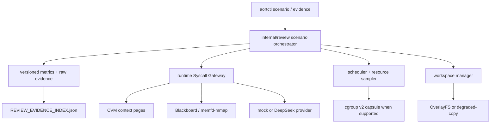
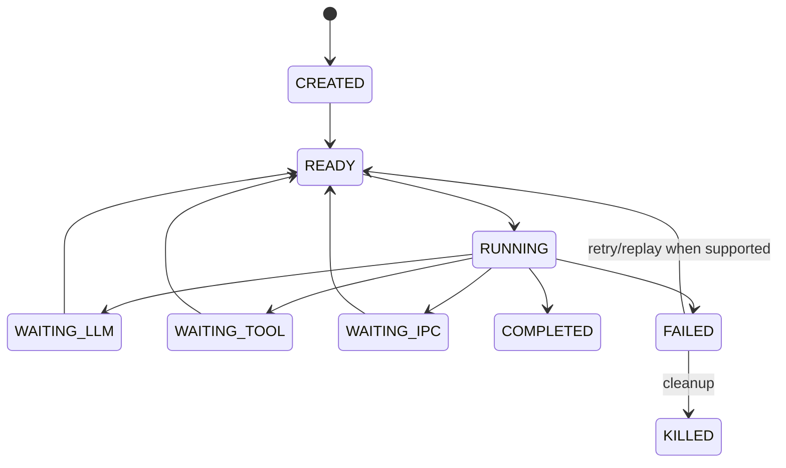

# 03 Architecture Overview

## 方案选择

本轮采用兼容扩展：保留现有 daemon、worker、实验和 final evidence，在其上增加 `internal/review` 场景层。这样既复用真实实现，也避免为了评审另造一套不可验证的平行 Runtime。

## 控制面与数据面

控制面负责参数、角色、模式、超时、清理和证据状态；数据面负责工具进程、上下文页、IPC 字节和实际耗时。Dashboard 与答辩材料只消费证据，不改变结果。

## AVP 生命周期

这是 AORT-R 状态机，不是 Linux task state 的替代。真实 worker PID/cgroup 由 `internal/worker` 与 `internal/capsule` 提供，平台不支持时以 degraded capsule 运行。

## 接口

- `review.RunResourceIsolation(ctx, cfg)`
- `review.RunContextSharing(ctx, cfg)`
- `review.RunAgentDemo(ctx, cfg)`
- `review.WriteReviewFinal(cfg)`

`internal/experiment/review_scenarios.go` 提供 CLI 适配，旧 `experiment` 和 `evidence final` 接口保持不变。

## 失败处理

每个 measured run 自带 timeout 和失败原因；场景完成后才汇总。`review-final` 在缺失或失败时仍写索引，然后返回错误，便于 CI/答辩前定位缺口。
