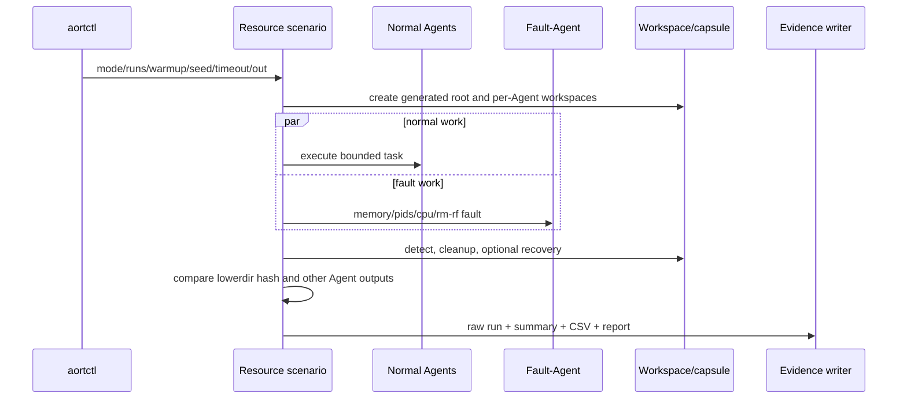

# 04 Resource Isolation and Fault Control

## 问题与目标

目标不是证明 Linux cgroup 或 OverlayFS 本身有效，而是验证 AORT-R 是否能把 Agent 故障限制在受控对象和临时工作区，并给出完整事件和清理证据。

## 数据流

## 关键实现

- `internal/review/resource_isolation.go`: 六角色、四类故障、计时和哈希。
- `safeRemoveWithin`: 绝对路径、`filepath.Rel` 和根目录保护；拒绝删除根本身、父目录及逃逸路径。
- `internal/workspace/manager.go`: aort-r workspace rm-rf 路径；支持 real-overlayfs 或 degraded-copy。
- `internal/capsule/manager.go`: openEuler/Linux 上的 cgroup v2 create/attach/stats/kill/destroy。
- `internal/resource/sampler.go`: memory.current、pids.current、cpu.stat 等采样。

## 模式差异

baseline 不声明独立 OS 边界；isolation-only 表示边界但不启用资源感知选择；aort-r 组合资源感知和 workspace lifecycle。便携场景不会把当前测试进程移动到宿主 cgroup；若无安全嵌套 cgroup，`evidence_mode=degraded`，真实 openEuler 能力引用 `experiments/results/final/FINAL_EVIDENCE_INDEX.json`。

## 指标定义

- `normal_agent_completion_rate`: 5 个正常 Agent 中成功数/5。
- `fault_containment_scope`: 本轮受影响 Agent 数。
- `lowerdir_hash_unchanged`: 故障前后文件内容哈希一致为 1。
- `cross_agent_contamination`: 任一正常 Agent 输出丢失为 1。
- detection/cleanup/recovery: 对应代码段的实际 wall-clock。

## 失败与清理

context deadline、工具错误和哈希错误都会产生 failed raw run。所有内存分配和进程数有上限；工作区由 `defer` 清理。真实 cgroup/挂载测试继续使用已有 openEuler smoke，不在便携场景中冒险修改系统关键路径。

## 当前实验结论

本机 portable run 为 degraded，但 60 个 measured runs 全部任务成功，aort-r 的 `lowerdir_hash_unchanged.mean=1`、`cross_agent_contamination.mean=0`。这证明场景安全和用户态工作区闭环，不替代 real-cgroup-v2/real-overlayfs 证据。
