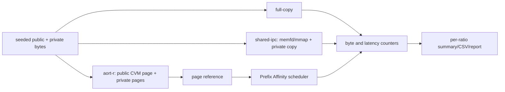

# 05 Context Sharing and Communication

## 问题与目标

同一项目上下文被 N 个 Agent 使用时，full-copy 会重复写入和传输公共部分。目标是分别测量逻辑可见量、实际写入量、实际传输量和 materialization 量，并验证共享比例变化时计数关系正确。

## 数据流

## 方案选择

- full-copy 是公平 baseline，复制逻辑上每个 Agent 看到的完整上下文。
- shared-ipc 复用 `internal/ipc/shm` 的 memfd/mmap/fd-passing 路径；非 Linux 标记 degraded。
- aort-r 复用 `internal/cvm` 的 SHA-256 内容页和 `internal/scheduler` 的 Prefix Affinity。它不接触模型内部 KV Cache。

## 关键计数

- `logical_context_bytes = context_size * agents`。
- `physical_bytes_written`: 唯一公共数据加各 Agent 私有数据，或 full-copy 总写入。
- `bytes_transferred`: 真实 payload/page-reference 计数。
- `saved_bytes = logical_context_bytes - bytes_transferred`，由本次计数推导。
- `materialized_bytes`: 本轮实际组装的数据量。
- 公共页和私有页按场景构造计数，避免把单 Agent 私有页因内部 refcount 语义误报为共享页。

## 调度与公平性

aort-r 为候选 AVP 填入公共 Page ID，调用 `scheduler.PolicyTokenCFSPrefixAffinity`。首个 Agent 后，选择到共享公共页的 Agent记为命中。等待样本计算 P50/P95 和 Jain fairness；`peak_rss_bytes` 仅在 `/proc/self/status` 可用时标 measured，否则为 unsupported。

## 失败处理

memfd/mmap 不可用时 shared-ipc 写 degraded evidence，不伪造成功。任何 context timeout 或 CVM 错误保留 raw 失败样本。0% 共享必须满足 transferred=logical、saved=0；该不变量有回归测试。

## 当前实验结论

6 Agent、4096 bytes/Agent、20 measured runs/变体：full-copy 在四档比例均传输 24576 bytes；aort-r 在 0/25/50/75% 分别传输 24576/18496/12352/6208 bytes，derived saved bytes 为 0/6080/12224/18368。该结果是运行时上下文传输计数，不是模型 KV Cache 或端到端模型吞吐结论。
