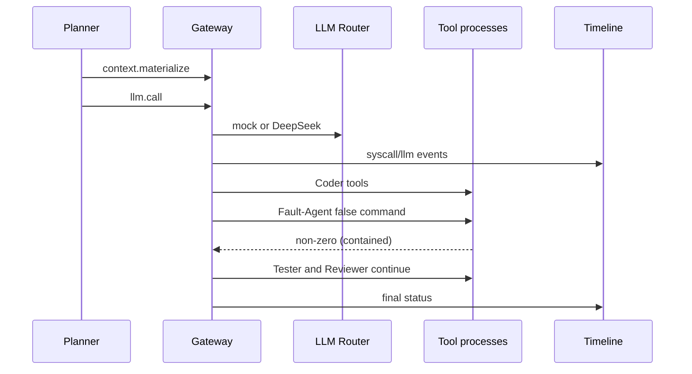

# 09 Real Agent Availability Demo

## 目标

证明现有 CVM、LLM Router、Syscall Gateway、工具执行和 Timeline 能在一个 6-Agent 任务中串联；网络模型只验证服务可用性，不作为性能 baseline。

## 角色与流程

Planner、Coder-A、Coder-B、Tester、Reviewer、Fault-Agent 由 `internal/review/agent_demo.go` 创建。Planner 先通过 Gateway materialize context，再执行一次 `llm.call`；Coder/Tester/Reviewer 通过 Gateway 执行工具。Fault-Agent 执行受控 `false` 命令，返回非零后其他 Agent 继续。

## provider

mock 固定输入/输出和 seed，适合离线重复。deepseek 只有 `AORT_ENABLE_REAL_LLM=1` 且环境有 `DEEPSEEK_API_KEY` 才运行，否则 summary=skipped/missing。Key 和 Base URL 不写 evidence。

DeepSeek provider 的 `total_ms` 记为 end-to-end API/network measured；远端模型纯执行时间不可分离，标为 unsupported；Gateway overhead 由总耗时与 provider 耗时推导。

## 输出与失败处理

输出 `timeline.json`, `final_result.json`, `summary.json`, `report.md`。任何 LLM 错误写 failed evidence 后返回错误；无 Key 是 skipped，不伪装为 mock 成功。所有 timeline payload 写盘前递归脱敏。

## 当前结果

本轮 mock 运行 passed：6 roles、1 LLM call、5 tool calls、fault contained=true、continued=true。真实 API 本轮因环境无 Key 未执行；已有历史 real-api evidence 在旧 final 中单独引用。
