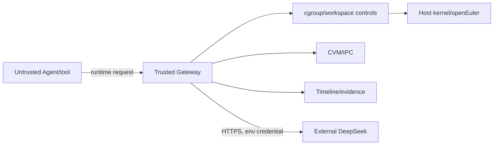

# AORT-R Threat Model

## 资产

公共代码/上下文、各 Agent 私有工作区、宿主 CPU/memory/pids、Runtime/Gateway 控制面、DeepSeek credential、Timeline/raw evidence 和最终索引。

## 主体与信任边界

- 受信：AORT-R Runtime、Gateway policy、证据生成器、宿主内核配置。
- 受限信任：正常 Agent worker。
- 不受信：失控/恶意 Agent、工具子进程、外部输入。
- 外部信任域：DeepSeek API、网络、远程 openEuler 主机。

## 威胁、缓解和残余风险

| 威胁 | 现有缓解 | 残余风险/证据 |
|---|---|---|
| memory/CPU/pids 耗尽 | cgroup v2 limits、ResourceSampler、bounded scenario | portable run degraded；real-only openEuler 才证明内核限制 |
| 进程树失控 | pids.max、cgroup.kill、PID signal fallback、timeout | fallback 不能保证杀死所有逃逸进程 |
| 工作区删除/污染 | per-Agent OverlayFS、lowerdir、safe path guard、rollback | 无完整 mount namespace 时仍依赖 Runtime 正确性 |
| 未受控工具调用 | Gateway command/cwd confinement、timeout、audit | 不是 seccomp allowlist；宿主命令仍有风险 |
| IPC 数据错误 | page ID lookup、CVM hash、data-integrity smoke | 无端到端认证/加密，多租户攻击未覆盖 |
| 证据缺失/篡改 | raw per-run、versioned index、failure preservation | 本地文件可被高权限用户修改，无签名/远程证明 |
| API Key 泄漏 | env-only、不序列化 Key、写前脱敏、测试扫描 | 外部进程环境/宿主审计仍可能暴露，需要部署侧 secret manager |
| eBPF 观测缺失 | degraded reason、Gateway proxy events | 当前不能证明完整内核事件覆盖 |
| Runtime 自身被攻破 | 模块化边界、测试 | 无进程隔离或最小权限部署证明 |

## 安全不变量

1. 删除只允许发生在本轮生成根目录的后代路径。
2. API Key 不得进入源码、CLI 参数、日志、JSON、CSV、Markdown 或 Git 历史。
3. 不支持的 OS 能力必须是 degraded/unsupported，不得以 passed 代替。
4. 旧 evidence 只读；新报告写独立目录。
5. `passed` 不能与 failed measured runs 并存。

## 非目标

本项目当前不是完整容器、VM、SELinux policy、内核补丁或完整 Agent OS。单机 openEuler 证据不能外推为多租户或分布式安全保证。
